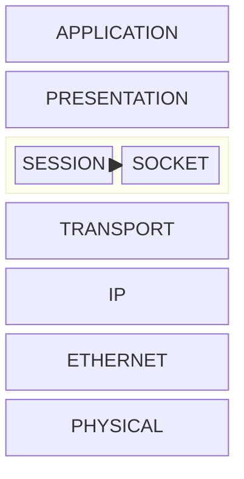

# Socket quésaco ?


> A network socket is a software structure within a network node of a computer network that serves as an endpoint for sending and receiving data across the network.

<span class="text-sm italic" >source : <https://en.wikipedia.org/wiki/Network_socket></span>

<div v-click="[2,3]">
  
  > En résumé, un socket c'est le lien entre la couche de transport et la couche applicative

  Maintenant, un peu de code

</div>

::right::

<div v-click="[1,3]">
<div class="text-center">



Model OSI

</div>
</div>

---
hideInToc: true
---
# Socket quésaco ?

## Instancier un socket

<style>

.slidev-vclick-hidden{
    display: none;
}

.slidev-layout{
    overflow: scroll;
}

</style>

````md magic-move

```asm
section .text

socket_listen:
    mov rax, 97 ; 
    mov rdi, 2  ; 
    mov rsi, 1  ; 
    mov rdx, 0  ; 
    syscall

```
```asm
section .text

socket_listen:
    mov rax, 97 ; SYSCALL SOCKET
    mov rdi, 2  ; AF_INET
    mov rsi, 1  ; SOCK_STREAM
    mov rdx, 0  ; PROTOCOL
    syscall

```

```c
// Définition
int socket(int domain, int type, int protocol);
```

```c
// Implémentation
int fd0 = socket(AF_INET, SOCK_STREAM, 0); // TCP/IPv4
int fd1 = socket(AF_INET, SOCK_DGRAM, 0); // UDP/IPv4
int fd2 = socket(AF_INET, SOCK_RAW, IPPROTO_ICMP); //ICMP/IPv4
```

```c
// Implémentation
int fd0 = socket(AF_INET, SOCK_STREAM, 0); // TCP/IPv4
```

````
<div v-click="[1,2]">
<span class="text-xs italic">
Très bon article sur la création de serveur TCP en assembler : https://aeryz.github.io/docs/small-projects/x86_64-tcp-server.html
</span>
</div>

<div v-click="[2,3]" class="text-xs">

| paramètre | description                                        |
|-----------|----------------------------------------------------|
| domain    | la famille d'adresse (IPv4,IPv6,Bluetooth,...)     |
| type      | type de transport (STREAM, DGRAM, RAW)             |
| protocol  | le protocol à utiliser (0 = en fonction du domain) |

</div>

<div v-click="[4]" class="text-xs overflow-scroll">

| Nom de la Fonction | Description                                                                   |
|--------------------|-------------------------------------------------------------------------------|
| `accept`           | Accepte une connexion entrante sur le socket.                                 |
| `bind`             | Associe une adresse locale à un descripteur de socket.                        |
| `close`            | Ferme un descripteur de socket.                                               |
| `connect`          | Établit une connexion à un socket distant.                                    |
| `epoll`            | Interface de notification d'événements pour les sockets (Linux spécifique).   |
| `fcntl`            | Manipule les descripteurs de fichiers (y compris les sockets).                |
| `getpeername`      | Récupère l'adresse du pair connecté à un socket.                              |
| `getsockname`      | Récupère l'adresse locale associée à un socket.                               |
| `getsockopt`       | Récupère les options du socket.                                               |
| `ioctl`            | Effectue des opérations de contrôle d'E/S sur le socket.                      |
| `listen`           | Met le socket en mode écoute pour accepter des connexions entrantes.          |
| `poll`             | Vérifie l'état de plusieurs descripteurs de fichier ou de socket.             |
| `recv`             | Reçoit des données d'un socket connecté.                                      |
| `recvfrom`         | Reçoit des données d'une adresse spécifique (pour les sockets non connectés). |
| `select`           | Surveille plusieurs descripteurs de fichier ou de socket pour les événements. |
| `send`             | Envoie des données sur un socket connecté.                                    |
| `sendto`           | Envoie des données à une adresse spécifique (pour les sockets non connectés). |
| `setsockopt`       | Définit les options du socket.                                                |
| `shutdown`         | Désactive les opérations d'envoi et/ou de réception sur un socket.            |
| `socket`           | Crée un nouveau descripteur de socket.                                        |

</div>


